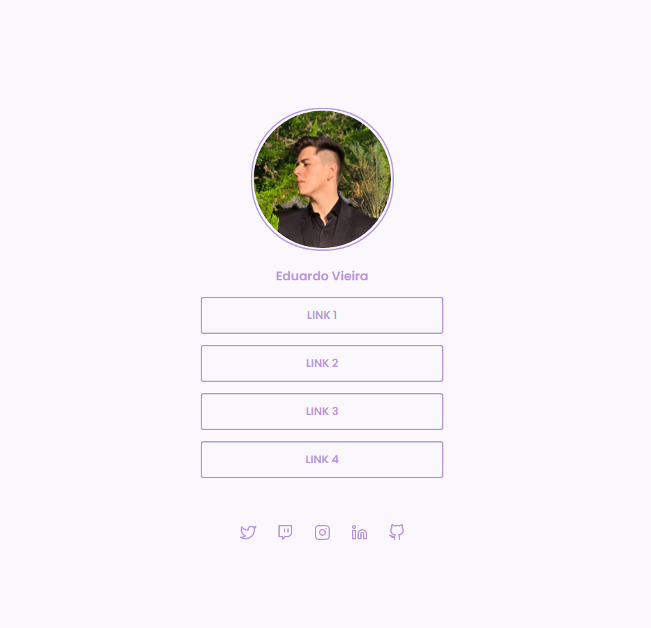

<h1 align="center"> Link list </h1>

 

  <a href="#-tecnologias">Tecnologias</a>&nbsp;&nbsp;&nbsp;|&nbsp;&nbsp;&nbsp;
  <a href="#-descrição">Descrição</a>&nbsp;&nbsp;&nbsp;|&nbsp;&nbsp;&nbsp;
  <a href="#memo-licença">Licença</a>

  

## 🚀 Tecnologias

Esse projeto foi desenvolvido com as seguintes tecnologias:

- HTML
- CSS
- Figma
- Git e Github

## 💻 Descrição

Agregador de links contando com diversos links para diversas redes sociais e personalizáveis!  
P.S.: Esse projeto foi baseado em um desafio do programa *Discover* da @rocketseat.

 

  

 

## :memo: Licença

Esse projeto está sob a licença MIT.

---
